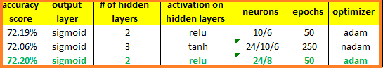

# Neural_Network_Charity_Analysis
New project on Neural Network Charity_Analysis analysis. An analysis to create a binary classifier that is capable of predicting whether applicants will be successful if funded by Alphabet Soup.

## Project Overview
From Alphabet Soup’s business team, Beks received a CSV containing more than 34,000 organizations that have received funding from Alphabet Soup over the years. Within this dataset are a number of columns that capture metadata about each organization, such as the following:

- EIN and NAME—Identification columns
- APPLICATION_TYPE—Alphabet Soup application type
- AFFILIATION—Affiliated sector of industry
- CLASSIFICATION—Government organization classification
- USE_CASE—Use case for funding
- ORGANIZATION—Organization type
- STATUS—Active status
- INCOME_AMT—Income classification
- SPECIAL_CONSIDERATIONS—Special consideration for application
- ASK_AMT—Funding amount requested
- IS_SUCCESSFUL—Was the money used effectively

## Purpose
The purpose of this project is to create a binary classifier that is capable of predicting whether applicants will be successful if funded by Alphabet Soup.

## Resources
- **Data Source:** `charity_data.csv`, `AlphabetSoupCharity_starter_code.ipynb`
- **Software:** `VS Code`, `Jupyter Notebook`, `Anaconda`, `GitHub`
- **Libraries:** `tensorflow`, `pandas`, `OneHotEncoder`, `train_test_aplit`, `accuracy_score`, `StandardScaler`, `RandomForestClassifer`, `SVC`

## Neural_Network_Charity_Analysis Results

### Data Preprocessing
#### What variable(s) are considered the target(s) for your model?
The variable(s) that are considered the target(s) for the model target is `IS_SUCCESSFUL` column.

#### What variable(s) are considered to be the features for your model?
The variables that arfe considered to be the features for the model are:
- `APPLICATION_TYPE` — Alphabet Soup application type
- `AFFILIATION`— Affiliated sector of industry
- `CLASSIFICATION`— Government organization classification
- `USE_CASE`— Use case for funding
- `ORGANIZATION`— Organization type
- `STATUS` — Active status
- `INCOME_AMT` —`Income classification
- `SPECIAL_CONSIDERATIONS` — Special consideration for application
- `ASK_AMT`— Funding amount requested

#### What variable(s) are neither targets nor features, and should be removed from the input data?
The variable (s) that are neither targets nor features , and should be removed from the input data are:
- `EIN and NAME` — Identification columns

### Compiling, Training, and Evaluating the Model

#### How many neurons, layers, and activation functions did you select for your neural network model, and why?
Below is a chart of the various models attempted and the parameters used. We first started with two (2) layers then increased to three (3), then back to two (2) for optimatization purposes. This was mostly done on a trial and error basisi to see which could produce the best results in an attempt to score a 75% accuracy score.

>**Image showing the different `model attempts` for optimization:**
>
>

#### Were you able to achieve the target model performance?
No. The target model performance of 75% was not achieved. The accuracy achieved was avergaging around `72%`.

#### What steps did you take to try and increase model performance?
Several models were used to try to reach the 75% accuracy score. For the neural network model, several hidden layers were attempted. Neurons were adjusted. Number of epochs were increased. Different optimizers were tried. The activations attemped were 'relu' and 'tanh'. Also, an attempt was made to drop rows of noisy data from the ASK_AMT column. This was unsuccessful and the attempt was abandoned.

## Summary
While the 75% target was not achieved, the most accurate of all the attempts was the relu with 2 layers at 24 and 8 neurons, 50 epochs and the adam optimizer. This model rendered a 72.85% accuracy score.

One model that would be recommended to solve the classification problem would be that of `Random forest classifier` due it the model's ability to provide insights which are not only easy to establish, interpret and implement but also faster compared to other neural models.